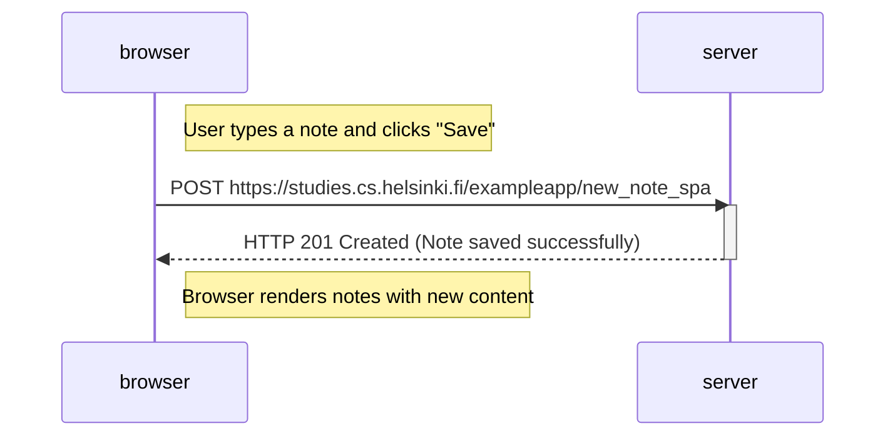

```mermaid
sequenceDiagram
    participant browser
    participant server
    
    Note right of browser: User types a note and clicks "Save"
    
    browser->>server: POST https://studies.cs.helsinki.fi/exampleapp/new_note_spa
    activate server
    server-->>browser: HTTP 201 Created (Note saved successfully)
    deactivate server

    Note right of browser: Browser renders notes with new content
    
  
```
